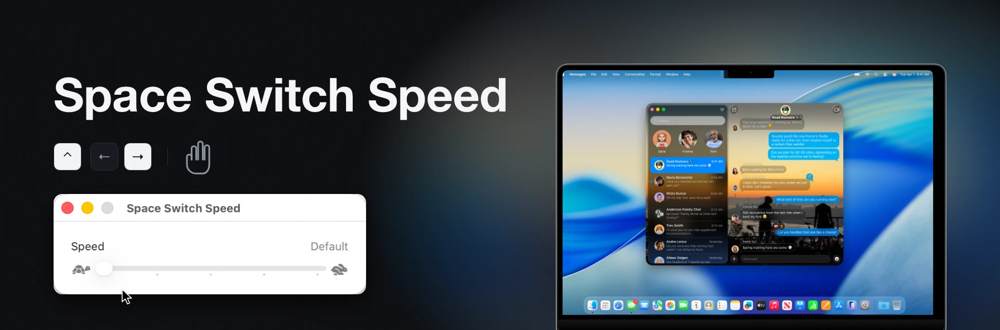

<p align="center">
  
</p>

# Space Switch Speed

**Make the macOS Space-switching animation as fast as you want.**

The slide between desktops — the one you get from a three-finger swipe, `Control + →`,
Mission Control, or moving in and out of a full-screen app — takes about a third of a
second, and macOS has no setting to change it. The `defaults write` commands you will
find online [stopped working years ago](#why-defaults-write-doesnt-fix-this). Space
Switch Speed adds the slider Apple never shipped.

[](#compatibility)
[](#compatibility)
[](LICENSE)

## Requirements

- An Apple Silicon Mac running macOS 15 Sequoia or later. Intel Macs are not supported.
- An administrator account.
- SIP's debugging restrictions turned off. That is step 1 below. It is a real security
  tradeoff, so [read what it means](#system-integrity-protection) before you do it.

## Install

### 1. Turn off SIP's debugging restrictions

Space Switch Speed changes a running Apple process, and System Integrity Protection
blocks that for everyone, root included. Only one part of SIP is in the way,
**Debugging Restrictions**, and this turns off just that part. Everything else in SIP
stays on. It needs a trip to Recovery, so do it before anything else.

1. Shut the Mac down completely.
2. Press and **hold** the power button until "Loading startup options" appears.
3. Click **Options → Continue** to enter
   [macOS Recovery](https://support.apple.com/en-us/102518).
4. Choose **Utilities → Terminal** from the menu bar.
5. Run:

   ```bash
   csrutil enable --without debug
   ```

6. Answer its prompts, then restart.

`csrutil` warns that this is an unsupported configuration. That is expected. With
FileVault on, Recovery asks you to unlock the disk first; FileVault stays on.

To put it back later, make the same trip and run `csrutil clear`.

### 2. Install the app

Download `SpaceSwitchSpeed-<version>.dmg` from the
[Releases](https://github.com/bisak/SpaceSwitchSpeed/releases) page, open it, and drag
Space Switch Speed into the Applications folder beside it. Then clear the download
quarantine:

```bash
xattr -dr com.apple.quarantine "/Applications/Space Switch Speed.app"
```

The app is signed but not notarised by Apple, which needs a paid Developer ID, so macOS
refuses to open it until you do that. If you would rather not run a command, open the
app, let it be blocked, then click **Open Anyway** in **System Settings → Privacy &
Security**. Control-clicking the app and choosing Open no longer works on macOS 15.

Or build it yourself, which needs Xcode 26 or newer and skips the quarantine step:

```bash
git clone https://github.com/bisak/SpaceSwitchSpeed
cd SpaceSwitchSpeed
make install
```

### 3. Set the speed

Open Space Switch Speed and drag the slider. The first change asks for your password
once. That is all.

## Usage

The slider has five stops: **Default**, **Gentle**, **Balanced**, **Quick** and
**Instant**. Default is Apple's animation untouched, and each stop after it is a fixed
fraction of that. A change takes effect as you release the slider. Sliding back to
Default turns Space Switch Speed off entirely.

Your password installs a small background helper that puts the setting back whenever
Dock restarts, so the app does not need to stay open. After an update, the next change
asks once more. The setting is shared by every account on the Mac; from a standard
account, each change asks for an administrator's password.

macOS lists the helper under **System Settings → General → Login Items & Extensions**.
Switch it off there and Dock goes back to normal at once.

## Uninstall

**Space Switch Speed → Remove Space Switch Speed…** puts Dock back, removes everything
it installed, and quits. Then move the app to the Trash. If a Dock could not be put
back, it says so instead and leaves `killall Dock` to you.

Or just delete the app. The helper notices within a few minutes, puts Dock back and
removes itself. `killall Dock` clears the patch from that Dock at once, but while the
helper is installed it puts the patch back within a second; the switch under Login
Items, above, is what stops it.

This is everything it puts on your Mac:

- `/Library/LaunchDaemons/com.bisak.spaceswitchspeed.helper.plist`
- `/Library/PrivilegedHelperTools/com.bisak.spaceswitchspeed.helper`
- `/Library/Application Support/SpaceSwitchSpeed/`, which holds your setting
- the app's own preferences file in your home folder, which **Remove** clears for the
  account that runs it

## System Integrity Protection

**This is a real security tradeoff.** The steps are in [Install](#install); this is
what they mean.

Space Switch Speed works by writing to the memory of Dock, a running Apple process.
With SIP fully on, macOS forbids that for every process, root included, and no
permission dialog or entitlement allows it.

SIP is a set of protections rather than one switch, described on Apple's page
[About System Integrity Protection](https://support.apple.com/en-us/102149). Only
**Debugging Restrictions** stands in the way, and `csrutil enable --without debug`
turns off that one alone. Afterwards `csrutil status` reports
`unknown (Custom Configuration)` and lists each protection separately:

| Protection | `csrutil disable` | `--without debug` |
|---|---|---|
| Filesystem Protections | off | **on** |
| Kext Signing | off | **on** |
| DTrace Restrictions | off | **on** |
| NVRAM Protections | off | **on** |
| BaseSystem Verification | off | **on** |
| Debugging Restrictions | off | off |

**What you keep.** Filesystem Protections: root still cannot write to `/System`, `/bin`,
`/sbin`, most of `/usr`, or Apple's app bundles, which is how something that has got root
would otherwise make itself permanent. Gatekeeper, notarisation, sandboxing, TCC,
FileVault and the sealed system volume are unaffected too.

**What you give up.** Anything already running as root can attach to any Apple process
and read or write its memory. That is a genuine loss of defence-in-depth, and it is
exactly the capability Space Switch Speed uses. On Apple Silicon, any `csrutil` change
also lowers the boot policy to Permissive Security; the partial configuration keeps the
protections in the table but does not restore Full Security.

A full `csrutil disable`, which is what most guides tell you to run, also works. It gives
up every row of that table for no benefit here.

**Whether the trade is acceptable is your call.** A shared Mac, a work laptop under an
MDM policy, or anything holding credentials you cannot rotate: leave SIP alone and don't
use this tool. A personal Mac where you already run unsigned software: the added risk is
small, and tools such as yabai ask for the same thing.

Space Switch Speed never changes your SIP configuration. It detects the state, says so,
and stops. Turning anything off is a deliberate act performed by you, from Recovery, and
`csrutil clear` reverses it completely.

## How it works

Dock does not play a timed animation when you switch Space. It runs a spring, and the
switch ends when the spring has settled. Two constants in Dock set how stiff that spring
is.

Space Switch Speed changes those two constants in the running Dock process, solving for
the pair that gives the speed you asked for. Nothing is written to disk, and the change
disappears when Dock restarts, which is why the helper puts it back. Default writes
Apple's own constants back exactly, and Balanced really is half the time.

The disassembly, the constants, the patch and why it is safe are written up in
[docs/REVERSE-ENGINEERING.md](docs/REVERSE-ENGINEERING.md).

### Why `defaults write` doesn't fix this

Search for *"macOS space switch animation slow"* and every result tells you to run one
of these:

```bash
defaults write com.apple.dock workspaces-swoosh-animation-off -bool true
defaults write com.apple.dock expose-animation-duration -float 0.1
```

Neither does anything on any current macOS. The first was real in Mac OS X Lion and was
removed over a decade ago. The second only ever affected Mission Control's zoom, never
the Space slide. Neither string exists in the Dock binary any more. There is no
preference to set because there is no duration: the animation is a spring.

**Reduce Motion** (System Settings → Accessibility → Display) does work, but it replaces
the slide with a cross-fade and flattens every other animation on the system with it.

### Where people keep asking

- [can I increase the speed of the switch spaces animation?](https://discussions.apple.com/thread/253938203)
  — closed, with Reduce Motion marked as the answer.
- [Speed up desktop switching animation in macOS Tahoe](https://discussions.apple.com/thread/256195960)
  — closed, no setting found.
- [Switching spaces animation is very slow on high refresh rate screens](https://discussions.apple.com/thread/256054548)
  — open, and filed with Apple as a bug.

## What it does not do

- **Modify Dock, or anything else on the system volume.** The Dock binary is
  byte-identical before and after; everything it does write is listed under
  [Uninstall](#uninstall).
- **Persist in Dock.** The change lives in one process's memory, and `killall Dock`
  clears it; the helper then puts it back. If anything ever looks wrong, the switch
  under Login Items stops the helper and puts Dock back at once.
- **Change your SIP configuration, run a curl-to-bash installer, or phone home.**
- **Write to anything it has not identified.** It finds the code by its shape, not by
  hardcoded addresses, and checks that Apple's exact constants are present before
  touching anything. On a macOS build it doesn't recognise, it does nothing and says so.
- **Touch any other animation.** Mission Control, Launchpad, window minimising and app
  switching are unchanged.

## Compatibility

| | |
|---|---|
| Architecture | Apple Silicon only. |
| macOS | 15 Sequoia or later. 13 and 14 drive the animation from a fixed 60 Hz timestep rather than the display's, and are refused. |
| Displays | Any refresh rate, any number of monitors, nothing to configure. Each stop is roughly the same fraction of Apple's own timing on 60, 120 and 144 Hz; see the [FAQ](#faq). |
| SIP | Debugging restrictions off is all it needs. A full `csrutil disable` also works. |

### Which versions are verified

Each Dock below was checked against the binary from Apple's restore image for that
build. `make check-dock` does the same for the Dock on your own Mac.

| macOS | Dock | |
|---|---|---|
| 13.0 (22A380) | 2206 | refused |
| 14.0 (23A344) | 2273.1.100 | refused |
| 14.6.1 (23G93) | 2273.105 | refused |
| 15.0 (24A335) | 2341.0.1 | works |
| 15.6.1 (24G90) | 2341.6.1 | works |
| 26.0 (25A354) | 2427.0.4 | works |
| 26.2 (25C56) | 2427.2.4 | works |
| 26.4 (25E246) | 2427.4.7 | works |
| 26.6.2 (25G83) | 2427.6 | works |
| 27.0 beta 8 (26A5425a) | 2571.0.6.402 | works |

## FAQ

**Will a macOS update break it?**
It may. The animation is found by the shape of its code rather than by address, which
has held across every release in the table above, but a real rewrite of Dock would
defeat it. When that happens it refuses to patch rather than guessing, and
`killall Dock` clears anything it had already done.

**Is the animation slower on a 120 Hz or ProMotion display?**
Yes. Dock's spring runs per frame, so the same constants animate about a third slower
on a 120 Hz display than on a 60 Hz one, and Apple has not changed that. Space Switch
Speed does not read the refresh rate; each stop is roughly the same fraction of Apple's
timing on any display, within a tenth at Balanced and a fifth at Instant, so Quick on a
ProMotion display is still a little slower than Quick on a 60 Hz one. The measurements are
in [the write-up](docs/REVERSE-ENGINEERING.md).

**Is this about "Spaces", "desktops" or "workspaces"?**
All the same thing. Full-screen apps are Spaces too, so the slider covers moving in and
out of those as well.

**Can I remove the animation entirely?**
**Instant** covers the distance in 50–70 ms, which reads as a cut. Anything faster fights the
trackpad's gesture tracking. For no animation at all, use Reduce Motion.

**Does it slow down my Mac or use battery?**
No. It changes two numbers Dock already reads every frame. The helper waits on events
and wakes once a minute to check nothing was missed. No code is injected.

**Is this the same as yabai, Amethyst or Rectangle?**
No. Those are window managers. This changes one animation.

**Why does it need root as well as the SIP change?**
The SIP change makes attaching to Dock *possible*; root makes it *permitted*. Both
checks are separate.

## Alternatives

| | Speed | Animation | Needs |
|---|---|---|---|
| [InstantSpaceSwitcher](https://github.com/jurplel/InstantSpaceSwitcher) | 5 presets | Immediate, or a shortened Dock slide | Accessibility |
| [space-rabbit](https://github.com/Tahul/space-rabbit) | 5-step slider | Immediate, or a shortened Dock slide | Accessibility |
| [Blink](https://github.com/benkoppe/Blink) | 5 presets, plus custom | Immediate, or a shortened Dock slide | Accessibility |
| [FasterSwiper](https://github.com/mgbowen/FasterSwiper) | Duration and easing curve | Its own easing curve | Accessibility |
| [strafe](https://github.com/rileycx/strafe) | 3 presets | Immediate, or an 80–110 ms ramp | Accessibility |
| [instantspaces](https://github.com/flawnn/instantspaces) | Two build-time modes | Immediate, or a fixed 0.125 s slide | SIP relaxed, code injection |

Most of these post a synthetic trackpad swipe, so they need only Accessibility. Dock
finishes the switch itself, which is why the result is either immediate or Dock's own
flick. FasterSwiper and strafe drive the slide themselves, so those two have a duration
to set. instantspaces patches Dock instead, overwriting its transition duration.

macOS 27 changed the event format. space-rabbit, FasterSwiper,
[iss](https://github.com/joshuarli/iss) and [noswoosh](https://github.com/mmathys/noswoosh)
have code for it; the rest do not. None of it is settled while 27 is in beta.

## Contributing

Issues and pull requests are welcome, particularly reports from macOS versions or
hardware I cannot test on. `make` lists every target, and `make ci` runs the same checks
a release does.

If Space Switch Speed refuses to patch your Dock, open an issue with your macOS version,
build number and Mac model, and what the helper said:

```bash
log show --last 1h --predicate 'subsystem == "com.bisak.spaceswitchspeed"'
```

## Disclaimer

**This software is provided "as is", without warranty of any kind, express or implied,
including but not limited to the warranties of merchantability, fitness for a particular
purpose and non-infringement. In no event shall the author or copyright holder be liable
for any claim, damages or other liability, whether in an action of contract, tort or
otherwise, arising from, out of or in connection with the software or the use or other
dealings in the software.**

Specifically and without limitation, the author accepts **no liability** for:

- Any consequence of disabling System Integrity Protection, including security
  compromise, malware, data loss or theft
- Any instability, crash, hang or data loss in Dock, the window server or macOS
- Any damage to hardware, software, or data, or any loss of business, profit or time
- Any breach of warranty, support agreement or corporate security policy resulting from
  modifying your system

This project is **not affiliated with, endorsed by, or connected to Apple Inc.** It
modifies the behaviour of Apple software in memory at runtime. Doing so may violate the
macOS software licence agreement. Determining whether you are permitted to run it is
your responsibility.

**You run this entirely at your own risk.** If any of the above is unacceptable to you,
do not use this software.

## License

[GNU Affero General Public License v3.0 or later](LICENSE).

You may use, study, modify and redistribute this software. If you distribute it, or run
a modified version as a network service, you must make your source available under the
same licence.
